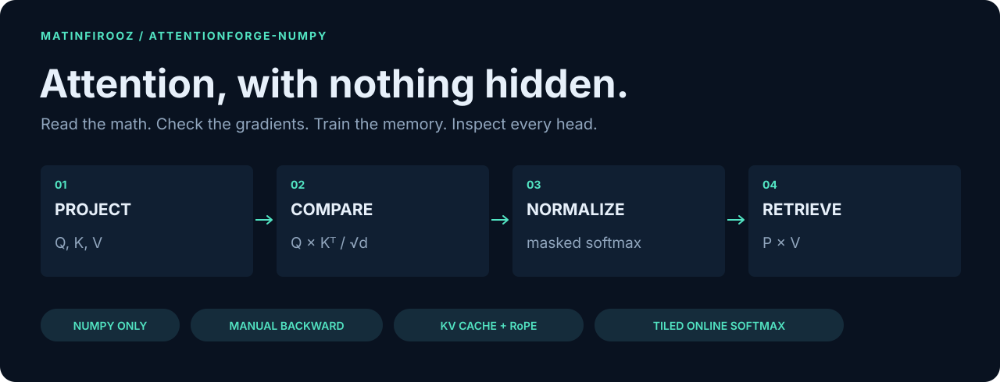
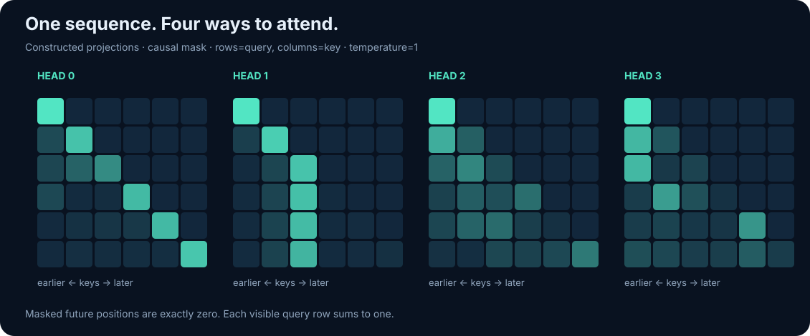
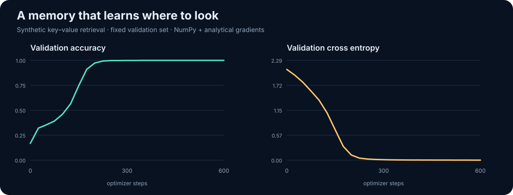
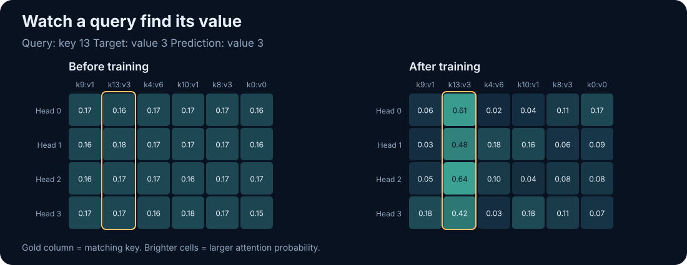
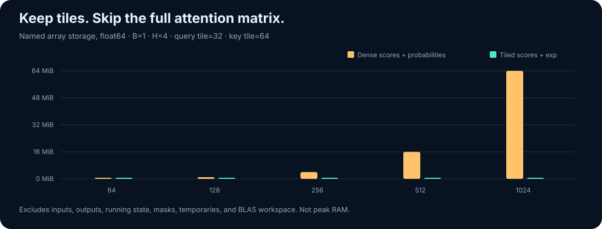

<p align="center">
  
</p>

<h1 align="center">AttentionForge · NumPy</h1>

<p align="center"><strong>Attention you can read, differentiate, train, and inspect.</strong></p>

<p align="center">
  
  
  
  <a href="LICENSE"></a>
</p>

<p align="center">
  <a href="#quick-start">Run it</a> ·
  <a href="#watch-a-memory-learn">See it learn</a> ·
  <a href="docs/MATH.md">Read the math</a> ·
  <a href="notebooks/Attention_From_Scratch.ipynb">Open the notebook</a> ·
  <a href="docs/PUBLISH.md">Publish on GitHub</a>
</p>

Built by [**@matinfirooz**](https://github.com/matinfirooz). One third-party runtime
dependency: **NumPy**. Every forward pass, analytical gradient, Adam update,
rotary embedding, and cached decode is implemented here. Graphics use SVG and
the Python standard library. An offline browser explorer lets you inspect
precomputed NumPy tensors without a server.

## What makes this worth exploring?

| Build | Inspect | Verify |
|:--|:--|:--|
| Scaled dot-product attention | Actual scores, probabilities, and outputs | Independent scalar reference |
| Self-attention and cross-attention | Four separate attention heads | Projection and input finite differences |
| Causal and padding masks | Hidden keys with exactly zero weights | Future-token and padding invariance |
| Manual backpropagation + Adam | A key–value retrieval model learning to focus | End-to-end parameter gradients |
| RoPE + preallocated KV cache | Token-by-token and chunked decoding | Agreement with full causal attention |
| Tiled online-softmax attention | Storage estimates and local timings | Agreement with dense attention |

## Quick start

Extract the project and open a terminal in its directory:

```bash
cd AttentionForge-NumPy
python -m venv .venv
```

Activate the environment on Linux/macOS:

```bash
source .venv/bin/activate
```

Or activate it in Windows PowerShell:

```powershell
.venv\Scripts\Activate.ps1
```

Install NumPy and run the first example:

```bash
python -m pip install -r requirements.txt
python -m examples.walkthrough
python -m unittest discover -s tests -v
```

Run commands from the **repository root**. The source is importable there;
an optional `python -m pip install -e .` makes the `attentionforge` package
importable from other directories too. Installing the package does not install
the repository's examples or notebooks.

The complete reproduction command runs tests, training, fresh evaluation,
gradient checking, cached decoding, benchmarking, and graphic generation:

```bash
python -m examples.reproduce
```

It updates the included `docs/results/` and `docs/assets/` files. No model
download, GPU, dataset download, or ML framework is required.

## Ten lines to understand attention

```python
import numpy as np
from attentionforge import scaled_dot_product_attention

q = np.array([[2., 0.], [0., 2.], [1., 1.]])
k = np.array([[1., 0.], [0., 1.], [1., 1.]])
v = np.array([[10., 0.], [0., 20.], [30., 30.]])

output, weights = scaled_dot_product_attention(q, k, v)
print(weights.round(4))
print(output.round(4))
```

Probabilities:

```text
[[0.4458 0.1084 0.4458]
 [0.1084 0.4458 0.4458]
 [0.2483 0.2483 0.5035]]
```

The first query retrieves approximately `[17.8323, 15.5419]`. Its probability
row explains exactly how the three value vectors contribute.

$$
\operatorname{Attention}(Q,K,V)=
\operatorname{softmax}\left(\frac{QK^T}{\sqrt{d_k}}\right)V.
$$

For masks, temperatures, and every derivative, see [the annotated math guide](docs/MATH.md).

## One sequence, multiple heads



```python
from attentionforge import MultiHeadAttention

rng = np.random.default_rng(42)
x = rng.normal(size=(2, 12, 32))          # batch, tokens, model width
layer = MultiHeadAttention(32, 4, seed=42)
output, weights, cache = layer.forward(x, causal=True, return_cache=True)

print(output.shape)                     # (2, 12, 32)
print(weights.shape)                    # (2, 4, 12, 12)
```

For cross-attention, use `layer.forward(query, memory, memory)`. Query and
memory lengths can differ. The graphic above uses constructed Q/K/V tensors
to make the patterns visible; the token labels do not imply learned semantics.

## Watch a memory learn

The training demo samples six unique keys, assigns random values to them,
and asks the model to retrieve the value for one queried key:

| Memory key | Current value |
|:--|:--|
| `key 3` | `value 7` |
| `key 10` | `value 2` |
| `key 6` | `value 5` |

For this illustrative memory, asking for `key 10` should return `value 2`.
Every training batch redraws the keys, values, query, and memory order. Keys
have no permanent value label. The network must learn a retrieval rule.

```bash
python -m examples.train_recall --steps 600 --seed 42
python -m examples.evaluate_recall --examples 4096 --seed 2026
```





Included reference run: Python 3.12.14, NumPy 2.3.5, float64, seed 42,
600 Adam steps, batch size 64, four heads, width 32, **4,360 parameters**.

| Measurement | Result |
|:--|--:|
| Initial validation accuracy | 16.80% |
| Final validation accuracy, 1,024 examples | 100.00% |
| Final validation cross entropy | 0.0012 |
| Fresh test accuracy, 4,096 examples, seed 2026 | 100.00% |
| Checkpoint reload | Exact output agreement |

These are measured results for a small synthetic teaching task and one seed.
They do not measure general language understanding. Training and validation
use separate RNG seeds; the fresh test uses a third seed. The saved model,
[training history](docs/results/training_history.csv), [training report](docs/results/train_report.json),
and [fresh test report](docs/results/eval_report.json) are included.

## Gradients you can audit

```python
from attentionforge import attention_forward, attention_backward

output, saved = attention_forward(q, k, v)
dq, dk, dv = attention_backward(np.ones_like(output), saved)
```

The backward uses matrix products and a softmax Jacobian-vector product:

$$
D_S=P\odot\left(D_P-\operatorname{rowsum}(D_P\odot P)\right).
$$

For a multi-head layer:

```python
output_mha, _, saved_mha = layer.forward(x, return_cache=True)
dq_input, dk_input, dv_input, parameter_grads = layer.backward(
    np.ones_like(output_mha), saved_mha
)
# For self-attention, combine the three branches:
dx = dq_input + dk_input + dv_input
```

Do not mutate forward inputs or model parameters before
their backward calls. The recall demo uses these same analytical gradients;
there is no hidden autograd engine.

```bash
python -m examples.gradient_check
```

The included float64 finite-difference run had maximum Q/K/V absolute errors
below **1.4e-10**. See the [numerical report](docs/results/gradient_report.json).

## Decode with a KV cache and RoPE

```python
from attentionforge import KVCache

layer = MultiHeadAttention(32, 4, seed=42, rope=True)
cache = KVCache(batch_size=2, num_heads=4, max_length=12, head_dim=8)
outputs = []
for index in range(x.shape[1]):
    token_output, _ = layer.decode(x[:, index:index+1], cache)
    outputs.append(token_output)
decoded = np.concatenate(outputs, axis=1)
full, _, _ = layer.forward(x, causal=True)
np.testing.assert_allclose(decoded, full, rtol=1e-12, atol=1e-12)
```

```bash
python -m examples.decode
```

The cache is preallocated and supports whole chunks as well as single tokens.
It stores projected K/V, with rotary keys rotated once at insertion. Use one
cache per layer and sequence batch; reset it for a new sequence or after
changing model weights. Capacity overflow raises an error before insertion.
This is an attention-layer demo, not a text-generation model.

## Tiled attention, without a full score matrix

```python
from attentionforge import streaming_attention

tiled_output = streaming_attention(q, k, v, query_block=2, key_block=2)
dense_output, _ = scaled_dot_product_attention(q, k, v)
np.testing.assert_allclose(tiled_output, dense_output, atol=1e-12)
```

The tiled path keeps a running row maximum, normalizer, and weighted value
sum. It returns outputs directly without materializing complete score or
probability matrices. [The math guide](docs/MATH.md#8-tiled-online-softmax)
explains why rescaling makes this possible.



At `B=1, H=4, N=1024, d_v=32`, float64, tiles `32 × 64`:

| Named state | Dense | Tiled |
|:--|--:|--:|
| Scores + probability/exponential buffers | 64 MiB | 128 KiB |
| Running max, normalizer, and value accumulator | — | 34 KiB |

These are formulas for named arrays, **not measured peak process RAM**.
Inputs, output, masks, expression temporaries, and BLAS workspace are excluded.
The full output adds 1 MiB in either case. A supplied dense mask has its own
storage. The causal tiled path creates only tile-sized visibility masks.

```bash
# Set BLAS threads before NumPy starts for more comparable CPU measurements.
# Linux/macOS:
OPENBLAS_NUM_THREADS=1 OMP_NUM_THREADS=1 python -m examples.benchmark
# Cross-platform; honors existing thread settings:
python -m examples.reproduce
```

The included length sweep (`64` through `1024`) matched dense outputs to
within **1.4e-15**. [Raw local timings and storage formulas](docs/results/benchmark.json)
include the environment and repeat count. Readable NumPy tile loops can be
slower; no general speedup is promised. This is a CPU teaching implementation
of tiled online attention, not a FlashAttention GPU kernel. The tiled path is
forward-only.

## An attention explorer that works offline

Open **[`docs/attention_explorer.html`](docs/attention_explorer.html)** from your
downloaded repository in a browser. Select the head, query, mask, and
temperature; inspect probabilities, scaled scores, entropy, and output
channels. Everything is bundled in one file. The browser selects precomputed
NumPy results; it does not implement another attention backend.

GitHub's file viewer shows HTML source, so download the file to interact with
it. Regenerate the explorer and its source tensors with:

```bash
python -m examples.build_showcase
```

## Shape and mask contract

| Object | Shape or convention |
|:--|:--|
| Bare Q | `(..., query_length, key_channels)` |
| Bare K | `(..., key_length, key_channels)` |
| Bare V | `(..., key_length, value_channels)` |
| Leading dimensions | Q/K/V match exactly; input broadcasting is not used |
| MHA inputs | `(batch, sequence, d_model)` |
| MHA probabilities | `(batch, heads, query_length, key_length)` |
| Dtype | Matching `float32` or `float64` |
| Mask | Boolean; `True` means allowed; broadcasts to score shape |
| Per-batch key padding | `(batch, 1, 1, key_length)` for multi-head attention |
| Fully masked query | Zero probability row, output, and score gradients |
| RoPE convention | Adjacent channel pairs; even head width |

There are no additive masks, attention dropout, FFN layers, pretrained
weights, or framework compatibility wrappers. The model checkpoint is only
for this repository's synthetic recall task.

## Repository map

| Path | Purpose |
|:--|:--|
| `attentionforge/core.py` | Softmax, masks, dense attention, backward |
| `attentionforge/multihead.py` | Q/K/V/O projections, gradients, KV cache |
| `attentionforge/position.py` | Sinusoidal and rotary positions |
| `attentionforge/streaming.py` | Tiled online softmax and storage formulas |
| `attentionforge/optim.py` | Adam, cross entropy, gradient clipping |
| `attentionforge/recall.py` | Synthetic task, trainable model, safe NPZ checkpoints |
| `attentionforge/visuals.py` | Standard-library SVG renderer |
| `examples/` | Walkthrough, training, evaluation, checks, benchmarking, reproduction |
| `tests/` | 39 independent-reference and invariant checks |
| `notebooks/Attention_From_Scratch.ipynb` | Executed tutorial with actual outputs |
| `docs/` | Math guide, visual explorer, measured results, and GitHub instructions |
| `.github/workflows/ci.yml` | Python/NumPy compatibility test matrix |

The local reference run passed all 39 checks on Python 3.12.14 / NumPy 2.3.5.
The configured CI additionally exercises Python 3.10 / NumPy 1.x and
Python 3.12–3.13 / NumPy 2.x after upload; that remote matrix is not claimed
to have already run.

## References and credit

- Vaswani et al. — [Attention Is All You Need](https://arxiv.org/abs/1706.03762), 2017.
- Milakov and Gimelshein — [Online normalizer calculation for softmax](https://arxiv.org/abs/1805.02867), 2018.
- Su et al. — [RoFormer: Enhanced Transformer with Rotary Position Embedding](https://arxiv.org/abs/2104.09864), 2021.
- Dao et al. — [FlashAttention: Fast and Memory-Efficient Exact Attention with IO-Awareness](https://arxiv.org/abs/2205.14135), 2022.

This project is an educational implementation of established attention ideas.
It claims transparent implementation and reproducible teaching experiments,
rather than a new attention algorithm.

**MIT licensed · built for [@matinfirooz](https://github.com/matinfirooz).**
